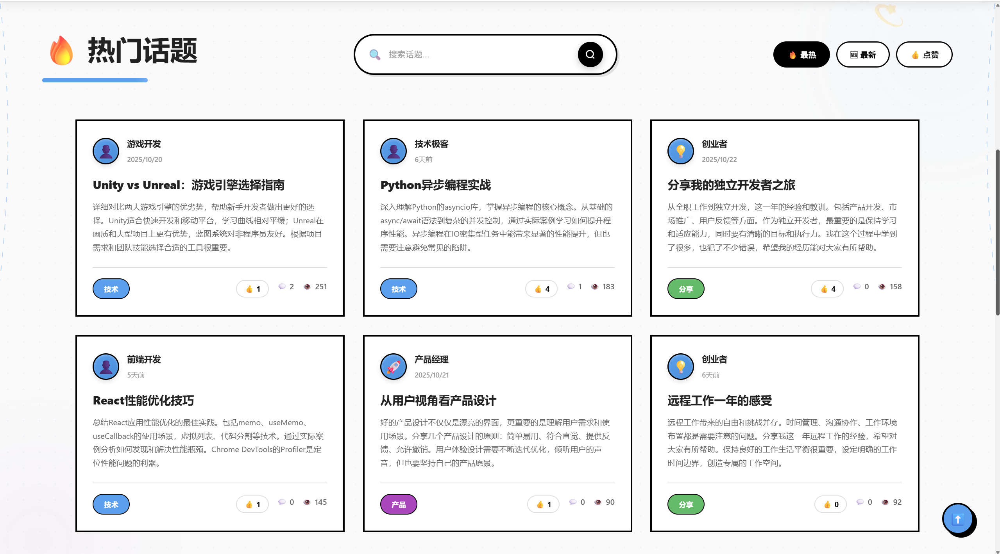
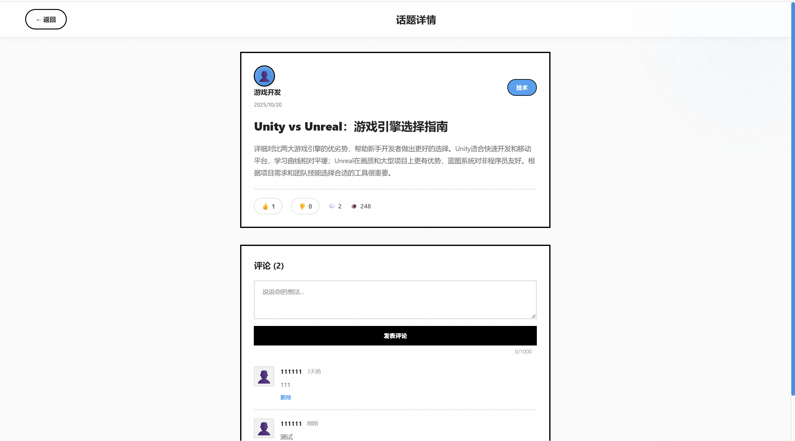
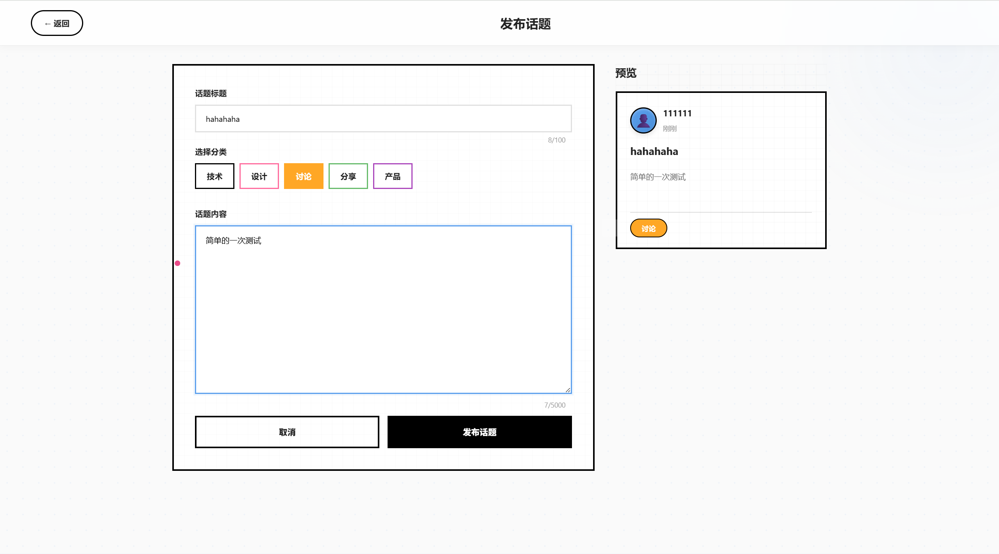

# Bullbell - Go 语言高性能论坛系统

[](https://golang.org/)
[](LICENSE)

> 基于 Go + Gin + MySQL + Redis + Elasticsearch + Kafka + Canal 的现代化论坛平台

## 项目简介

Bullbell 是一个功能完整的高性能论坛系统，采用 Go 语言开发。项目从零开始构建，实现了用户认证、内容发布、评论互动、全文搜索、热度排行等核心功能，并通过 Redis 缓存、分布式锁、定时任务等技术手段进行了性能优化。

**适合人群**：适合作为 Go 语言学习项目、校招简历项目或毕业设计。

## 项目亮点（写在简历上）

1. **完整的三层架构**：Controller-Logic-DAO 分层清晰，代码结构规范，易于维护和扩展
2. **数据一致性方案**：基于 Canal + Kafka 实现 MySQL 到 Elasticsearch 的实时数据同步，保证最终一致性
3. **分布式技术应用**：实现了基于 Redis 的分布式锁，使用 Snowflake 算法生成分布式 ID
4. **可观测性体系**：集成 Prometheus + Grafana 监控系统，实时监控 QPS、延迟、错误率等核心指标
5. **工程化能力**：Docker Compose 一键部署、Swagger API 文档、单元测试、CI/CD 自动化
6. **技术栈丰富**：涵盖 MySQL、Redis、Elasticsearch、Kafka、Canal 等主流技术，熟悉各组件的应用场景

## 核心亮点

| 维度 | 说明 |
|------|------|
| **架构设计** | 标准三层架构（Controller-Logic-DAO），代码结构清晰 |
| **数据一致性** | Canal + Kafka 实现 MySQL 到 ES 的实时同步，保证最终一致性 |
| **技术栈** | Go 1.21 + Gin + MySQL 8.0 + Redis 7 + Elasticsearch 8.11 + Kafka + Canal |
| **可观测性** | Prometheus + Grafana 监控体系，实时监控系统运行状态 |
| **实用功能** | JWT 认证、令牌桶限流、分布式锁、热度算法、树形评论 |
| **工程化** | Docker Compose 一键部署、Swagger 文档、单元测试、CI/CD 自动化 |
| **代码质量** | 完整的错误处理、结构化日志、单元测试覆盖 |

## 功能特性

### 基础功能
- 用户注册、登录（JWT 认证 + bcrypt 密码加密）
- 话题发布、浏览、分类管理
- 树形评论系统（支持多层级回复，默认折叠）
- 点赞投票功能
- 基于 Elasticsearch 的全文搜索（中英文混合）

### 性能优化
- **Redis 缓存**：话题列表、热点数据缓存，Cache Aside 模式
- **令牌桶限流**：防止恶意请求，保护系统稳定性
- **数据库优化**：连接池调优、索引优化、慢查询分析
- **异步处理**：Kafka 消息队列实现异步数据同步

### 进阶功能
- **数据同步**：Canal 监听 MySQL binlog + Kafka 消息队列，实现数据实时同步到 Elasticsearch
- **分布式锁**：基于 Redis SETNX + Lua 脚本，防止并发冲突
- **热度排行榜**：Reddit 算法 + 定时任务 + Redis ZSet
- **Snowflake ID 生成器**：支持分布式部署
- **监控告警**：Prometheus 指标采集 + Grafana 可视化监控
- **结构化日志**：JSON 格式，支持日志轮转

### 工程化实践
- Docker Compose 一键部署
- Swagger API 文档自动生成
- 单元测试 + 压力测试
- CI/CD 流水线（GitHub Actions）

## 界面展示

### 首页


### 话题列表


### 话题详情


### 发布话题


## 技术架构

### 后端技术栈
- **开发语言**: Go 1.21+
- **Web 框架**: Gin（高性能 HTTP 框架）
- **数据库**: MySQL 8.0，带连接池优化
- **缓存**: Redis 7，用于会话和数据缓存
- **搜索引擎**: Elasticsearch 8.11，实现全文检索
- **消息队列**: Kafka，异步数据处理
- **数据同步**: Canal，监听 MySQL binlog
- **监控系统**: Prometheus + Grafana
- **API 文档**: Swagger/OpenAPI
- **ID 生成**: Snowflake 算法，支持分布式部署

### 前端技术栈
- **核心技术**: HTML5、CSS3、原生 JavaScript
- **设计风格**: 现代简约风 + 毛玻璃效果（Glassmorphism）
- **UI 组件**: 自定义响应式组件
- **构建工具**: 原生 ES 模块，无需打包工具

### 基础设施与 DevOps
- **容器化**: Docker 和 Docker Compose
- **CI/CD**: GitHub Actions 工作流
- **代码质量**: golangci-lint、gosec 安全扫描
- **测试**: 单元测试 + 竞态检测器
- **日志**: 结构化 JSON 日志，支持轮转

## 快速开始

### 环境要求

- Go 1.21+
- MySQL 8.0
- Redis 7.0+
- Elasticsearch 8.11
- Kafka 3.5+
- Docker & Docker Compose（推荐）

### 使用 Docker Compose 部署（推荐）

```bash
# 克隆项目
git clone https://github.com/DancingCircles/Blossom.git
cd Blossom

# 启动所有服务
docker-compose up -d

# 查看服务状态
docker-compose ps

# 访问应用
# 前端: http://localhost:80
# 后端: http://localhost:8082
# Swagger API 文档: http://localhost:8082/swagger/index.html
# Prometheus: http://localhost:9090
# Grafana: http://localhost:3000 (默认账号密码: admin/admin)
# Kafka UI: http://localhost:8080
```

### 本地开发部署

#### 1. 启动依赖服务

```bash
# 启动 MySQL
docker run -d --name mysql \
  -e MYSQL_ROOT_PASSWORD=123456 \
  -e MYSQL_DATABASE=web_app \
  -p 13306:3306 \
  mysql:8.0

# 启动 Redis
docker run -d --name redis \
  -p 16379:6379 \
  redis:7-alpine

# 启动 Elasticsearch
docker run -d --name elasticsearch \
  -e "discovery.type=single-node" \
  -e "xpack.security.enabled=false" \
  -p 9200:9200 \
  elasticsearch:8.11.0

# 启动 Zookeeper
docker run -d --name zookeeper \
  -p 2181:2181 \
  confluentinc/cp-zookeeper:7.5.0

# 启动 Kafka
docker run -d --name kafka \
  -p 9092:9092 \
  -e KAFKA_ZOOKEEPER_CONNECT=zookeeper:2181 \
  confluentinc/cp-kafka:7.5.0
```

> **提示**：本地开发推荐直接使用 `docker-compose up -d`，会自动启动所有依赖服务

#### 2. 初始化数据库

```bash
cd web_app
mysql -h 127.0.0.1 -P 13306 -u root -p123456 web_app < sql/schema.sql
```

#### 3. 配置环境

编辑 `web_app/config.yaml` 文件，根据实际环境修改配置：

```yaml
app:
  name: "web_app"
  mode: "dev"
  port: 8082

mysql:
  host: "127.0.0.1"
  port: 13306
  user: "root"
  password: "123456"
  database: "web_app"

redis:
  host: "127.0.0.1"
  port: 16379

elasticsearch:
  url: "http://127.0.0.1:9200"
  index: "bullbell_topics"
```

#### 4. 启动后端服务

```bash
cd web_app

# 安装依赖
go mod download

# 生成 Swagger 文档
swag init

# 运行服务
go run main.go
```

#### 5. 启动前端服务

```bash
# 使用任意 HTTP 服务器
cd frontend

# 方式 1: Python
python -m http.server 3000

# 方式 2: Node.js
npx serve -p 3000
```

访问 http://localhost:3000 即可使用论坛。

## 项目结构

```
Bullbell/
├── .github/
│   └── workflows/
│       └── go.yml              # CI/CD 配置
├── canal/                      # Canal 配置
│   └── init.sql                # Canal 用户初始化脚本
├── prometheus/                 # Prometheus 配置
│   └── prometheus.yml          # Prometheus 配置文件
├── grafana/                    # Grafana 配置
│   ├── provisioning/           # 自动配置
│   │   ├── datasources/        # 数据源配置
│   │   └── dashboards/         # 仪表板配置
│   └── dashboards/             # 监控面板 JSON
│       └── bullbell-overview.json  # 系统概览面板
├── frontend/                   # 前端代码
│   ├── css/                    # 样式文件
│   │   ├── style.css          # 主样式（含毛玻璃导航栏）
│   │   ├── auth.css           # 认证页样式
│   │   ├── post.css           # 发帖页样式
│   │   └── topic-search.css   # 搜索页样式
│   ├── js/                     # JavaScript 文件
│   │   ├── main.js            # 主逻辑（含导航栏自动隐藏）
│   │   ├── api.js             # API 封装
│   │   ├── auth.js            # 认证逻辑
│   │   ├── detail.js          # 详情页
│   │   └── post.js            # 发帖逻辑
│   ├── index.html              # 首页
│   ├── login.html              # 登录页
│   ├── post.html               # 发帖页
│   ├── detail.html             # 详情页
│   └── nginx.conf              # Nginx 配置
├── web_app/                    # 后端代码
│   ├── controllers/            # 控制器层
│   │   ├── admin.go           # 管理控制器
│   │   ├── comment.go         # 评论控制器
│   │   ├── search.go          # 搜索控制器
│   │   ├── topic.go           # 话题控制器
│   │   └── user.go            # 用户控制器
│   ├── consumers/              # Kafka 消费者
│   │   └── es_consumer.go     # ES 同步消费者
│   ├── dao/                    # 数据访问层
│   │   ├── mysql/             # MySQL 操作
│   │   ├── redis/             # Redis 操作
│   │   └── elasticsearch/     # Elasticsearch 操作
│   ├── logic/                  # 业务逻辑层
│   │   ├── comment.go         # 评论逻辑
│   │   ├── search.go          # 搜索逻辑
│   │   ├── topic.go           # 话题逻辑
│   │   └── user.go            # 用户逻辑
│   ├── models/                 # 数据模型
│   │   ├── comment.go         # 评论模型
│   │   ├── response.go        # 响应模型
│   │   ├── topic.go           # 话题模型
│   │   ├── user.go            # 用户模型
│   │   └── vote.go            # 投票模型
│   ├── middleware/             # 中间件
│   │   ├── cors.go            # CORS 跨域
│   │   ├── jwt.go             # JWT 认证
│   │   ├── rate_limit.go      # 令牌桶限流
│   │   └── metrics.go         # Prometheus 指标
│   ├── routes/                 # 路由配置
│   │   └── routes.go          # 路由定义
│   ├── utils/                  # 工具函数
│   │   ├── jwt.go             # JWT 工具
│   │   ├── password.go        # 密码工具
│   │   ├── snowflake.go       # ID 生成
│   │   ├── distributed_lock.go # 分布式锁
│   │   └── hot_score.go       # 热度计算
│   ├── tasks/                  # 定时任务
│   │   └── hot_ranking.go     # 热度排名任务
│   ├── logger/                 # 日志系统
│   ├── settings/               # 配置管理
│   ├── docs/                   # Swagger 文档
│   ├── sql/                    # SQL 脚本
│   │   ├── schema.sql         # 数据库结构
│   │   └── migrate_to_snowflake.sql
│   ├── pic/                    # 项目截图
│   ├── config.yaml             # 配置文件
│   └── main.go                 # 入口文件
├── docs/                       # 文档目录
│   └── DISTRIBUTED_LOCK.md     # 分布式锁文档
├── docker-compose.yml          # Docker Compose 配置
├── Makefile                    # Make 命令
├── 面试问答手册.md              # 面试问题手册
└── README.md                   # 本文档
```

## 开发指南

### 代码规范

```bash
# 格式化代码
gofmt -w .

# 代码检查
go vet ./...

# 使用 golangci-lint
golangci-lint run
```

### 运行测试

```bash
cd web_app

# 运行所有测试
go test -v ./...

# 运行测试并生成覆盖率报告
go test -v -race -coverprofile=coverage.out ./...

# 查看覆盖率
go tool cover -html=coverage.out
```

### 压力测试

项目使用 go-wrk 进行性能测试：

```bash
# 安装 go-wrk
go install github.com/tsliwowicz/go-wrk@latest

# 测试健康检查端点
go-wrk -c 100 -d 10 http://localhost:8082/ping

# 测试话题列表
go-wrk -c 100 -d 10 http://localhost:8082/api/v1/topics

# 测试搜索
go-wrk -c 50 -d 10 "http://localhost:8082/api/v1/search?keyword=test"
```

**测试要点**：
- 建议在加载测试数据后进行压测
- 观察 Prometheus 和 Grafana 中的实时监控指标
- 关注 Kafka 消费延迟情况

### 生成 Swagger 文档

```bash
cd web_app

# 安装 swag
go install github.com/swaggo/swag/cmd/swag@latest

# 生成文档
swag init

# 访问文档
# http://localhost:8082/swagger/index.html
```

## API 文档

启动服务后访问：
- **Swagger UI**: http://localhost:8082/swagger/index.html
- **API JSON**: http://localhost:8082/swagger/doc.json

主要 API 端点：

### 公开接口
- `POST /api/v1/register` - 用户注册
- `POST /api/v1/login` - 用户登录
- `GET /api/v1/topics` - 获取话题列表
- `GET /api/v1/topics/:id` - 获取话题详情
- `GET /api/v1/search` - 搜索话题
- `GET /api/v1/search/hot` - 热门话题

### 需要认证的接口
- `GET /api/v1/user/info` - 获取用户信息
- `POST /api/v1/topics` - 创建话题
- `POST /api/v1/topics/:id/vote` - 话题投票
- `POST /api/v1/topics/:id/comments` - 发表评论
- `DELETE /api/v1/comments/:id` - 删除评论

## 技术实现细节

### 1. Canal + Kafka 数据同步
**架构流程**：
```
MySQL binlog → Canal Server → Kafka → Consumer → Elasticsearch
```

**核心特性**：
- Canal 监听 MySQL binlog，捕获数据变更
- Kafka 消息队列保证消息可靠传输
- 消费者实现幂等性消费，防止数据重复
- 代码位置：`web_app/consumers/es_consumer.go`

**数据一致性保证**：
- 使用文档 ID 作为 ES 主键，天然幂等
- Canal 支持断点续传，不会丢失数据
- Kafka offset 管理保证消息不重复消费

### 2. Prometheus + Grafana 监控
**监控指标**：
- HTTP 请求总数（按方法、路径、状态码分组）
- 请求延迟直方图（P50/P95/P99）
- 正在处理的请求数
- 错误率统计

**配置文件**：
- Prometheus: `prometheus/prometheus.yml`
- Grafana: `grafana/provisioning/`
- 监控面板: `grafana/dashboards/`
- 代码位置：`web_app/middleware/metrics.go`

### 3. 令牌桶限流算法
使用 Go 官方库 `golang.org/x/time/rate` 实现：
- 每 IP 独立限流器（100 req/s，burst 200）
- 超限返回 429 状态码
- 代码位置：`web_app/middleware/rate_limit.go`

### 4. Redis 缓存策略
- 话题列表：5 分钟 TTL
- 热门话题：10 分钟 TTL
- Cache Aside 模式：读取时缓存，更新时删除
- 代码位置：`web_app/dao/redis/`

### 5. 分布式锁实现
- Redis SETNX 命令 + UUID 唯一标识
- Lua 脚本保证原子性解锁
- 应用场景：防止投票重复、并发冲突
- 代码位置：`web_app/utils/distributed_lock.go`

### 6. 热度排行算法
- Reddit 算法：score = votes / (hours + 2)^1.8
- 定时任务每 5 分钟更新一次
- 使用 Redis ZSet 存储排行榜
- 代码位置：`web_app/tasks/hot_ranking.go`

### 7. Snowflake ID 生成
- 64 位长整型，包含时间戳、机器ID、序列号
- 支持分布式部署，避免 ID 冲突
- 代码位置：`web_app/utils/snowflake.go`

## 前端特色

- 毛玻璃导航栏：半透明背景 + backdrop-filter 效果
- 响应式设计：支持移动端和桌面端
- 滚动优化：导航栏自动隐藏/显示
- 流畅动画：页面切换和交互动画

## 生产环境建议

如果要部署到生产环境，建议做以下调整：

1. **安全加固**
   - 修改 CORS 为具体域名（不要用 *）
   - 启用 HTTPS
   - 修改默认密码和密钥

2. **性能调优**
   - 根据服务器配置调整限流参数
   - 配置数据库主从复制
   - 启用慢查询日志

3. **监控告警**
   - 接入 Prometheus + Grafana
   - 配置日志收集
   - 设置告警规则

## 贡献指南

欢迎贡献代码！请遵循以下流程：

1. Fork 本仓库
2. 创建特性分支 (`git checkout -b feature/AmazingFeature`)
3. 提交更改 (`git commit -m 'Add some AmazingFeature'`)
4. 推送到分支 (`git push origin feature/AmazingFeature`)
5. 开启 Pull Request

详细的贡献指南请查看：[CONTRIBUTING.md](docs/CONTRIBUTING.md)

## 相关文档

- [面试问答手册](面试问答手册.md) - 项目常见面试问题及回答技巧
- [分布式锁文档](docs/DISTRIBUTED_LOCK.md) - 分布式锁实现细节

## 许可证

本项目采用 MIT 许可证 - 详见 [LICENSE](LICENSE) 文件

## 作者

项目维护者: [@DancingCircles](https://github.com/DancingCircles)

---

如果这个项目对你有帮助，欢迎 Star 支持！
